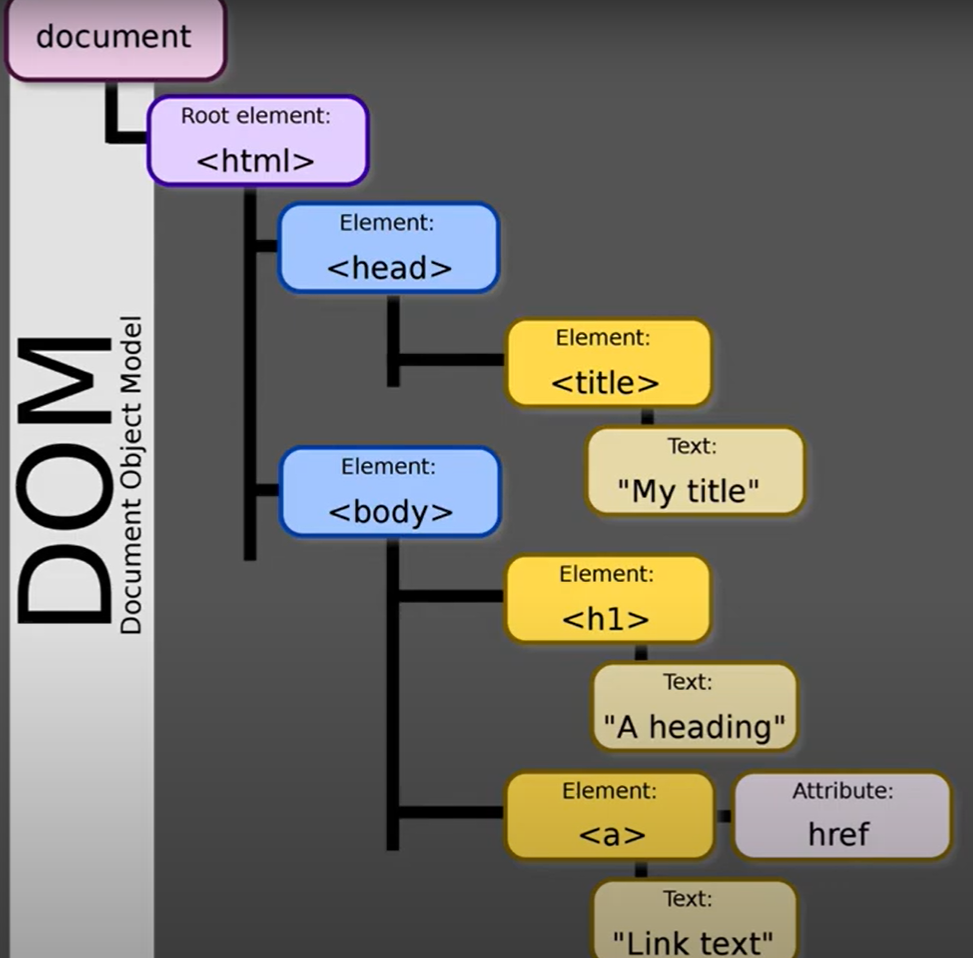

# Java Selenium
### Document Object Model Nedir?

HTML veya XML belgelerinin yapılandırılmasını ve işlenmesini sağlayan bir modeldir. Tarayıcılar, web sayfalarını yüklerken bu sayfaları DOM yapısına dönüştürürler. DOM, web sayfasındaki her öğeyi (etiketler, metinler, elementler vb.) bir "nesne" olarak kabul eder ve bu nesneler birbirleriyle ilişkili bir hiyerarşi içinde düzenlenir.
***
Bir ağaç yapısıdır. Root element <html>'dir. Daha sonra dallanarak derinliklere inilmektedir.


***
### En Sağlıklı Element Bulma Yöntemleri Nelerdir?

Elementleri bulurken farklı farklı stratijiler vardır. En sağlıklısı "id" kullanmaktır. XPATH, CSS, Class gibi özellikleri kullanabiliriz.

### Element Bulma ve Yazdırma Örneği

```
WebElement userNameElement = driver.findElement(By.id("userName"));
```
### Element "ID" sayesinde bulunur. Tıklanır ve içerisine metin yazdrılır.
```
        WebDriver driver = new ChromeDriver();
        driver.get("https://demoqa.com/text-box");

        // Elementi Bulma İşlemi.
        WebElement userNameElement = driver.findElement(By.id("userName"));
        userNameElement.click();
        userNameElement.sendKeys("Mahmut Can");
```
### Burada bir checkbox tıklama örneği vardır. Checkbox'a tıklarken bir hata aldık aynı "ID" özellikli bir label'e tıklandığı için hata alındı.
```
        WebElement sportCheckBox = driver.findElement(By.id("hobbies-checkbox-1"));
        WebElement sportCheckBoxLabel = driver.findElement(new By.ByCssSelector("label[for='hobbies-checkbox-1']"));
        boolean isEnabled = sportCheckBox.isEnabled();
        ((JavascriptExecutor) driver).executeScript("arguments[0].scrollIntoView(true);", sportCheckBox);
        System.out.println(isEnabled);
        
        // Aldığımız hata : Checbox yerine aynı işlevi gören Label'e tıklaması.
        
        if(isEnabled){
            try{
                System.out.println("Entered try block");
                sportCheckBox.click();
            }catch (ElementClickInterceptedException e) {
                System.out.println("Entered catch block");
                sportCheckBoxLabel.click();
            }
        }
        boolean isSelected = sportCheckBox.isSelected();
        System.out.println(isSelected);
```
### Sayfa bazen scroll olması gerekiyor onun için bir adet Javascript kodu kullanıyoruz.
```
WebElement sportCheckBox = driver.findElement(By.id("hobbies-checkbox-1"));
((JavascriptExecutor) driver).executeScript("arguments[0].scrollIntoView(true);", sportCheckBox);
```